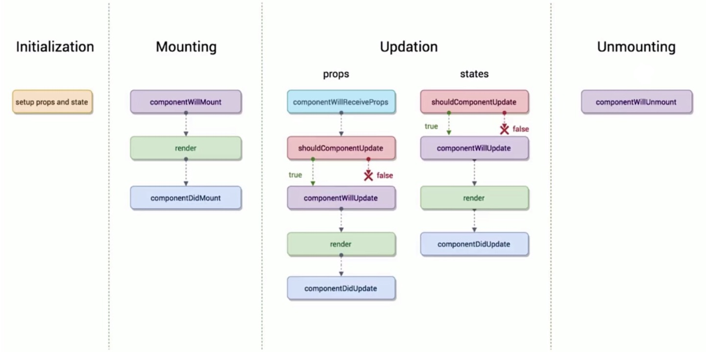
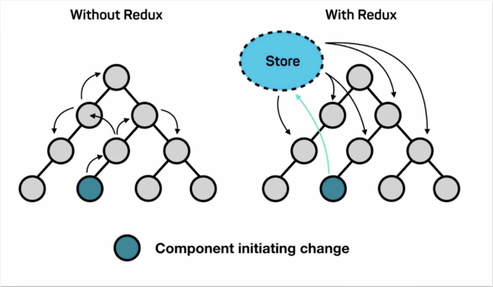
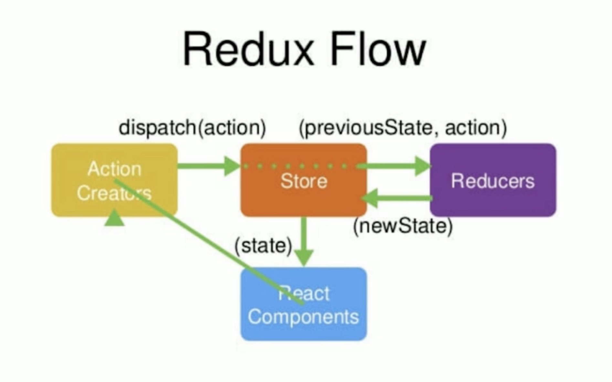

# React16.4 开发简书项目 从零基础入门到实战

## react 初探
### react 简介

1. Facebook 推出
2. 2013年5月开源
3. 函数式编程
4. 使用人数最多的前端框架
5. 健全的文档与 完善的社区
6. 16版本之后的称之为 react fiber 或者 16 版本中的底层实现

### 开发环境准备

1. 引入 .js 文件来使用 react 
2. 通过脚手架工具来编码 （grunt、gulp、webpack）
3. create-react-app （官方提供的、健壮性、使用简单……）

```javascript
npx create-react-app react-todolist
cd react-todolist
npm start

// 直接使用 npm install -g yarn 会报错，因为没有权限
sudo npm install -g yarn
// (开机密码)
Password:

```

```javascript
import React from 'react';
import ReactDOM from 'react-dom';
import App from './App';

/**
 * PWA: progressive web application
 * https 协议的服务器上，
 * 即使断网了第二次进来依然可以看到之前访问到，
 * 因为 registerServiceWorker 会帮助我们把之前的网页存储在浏览器之内
 */
// import registerServiceWorker form './registerServiceWorker';

ReactDOM.render(
  <App />,
  document.getElementById('root')
);
```

### JSX 语法

使用 jsx 语法必须引入 react，不然没办法编译直接报错（render 里面的标签都是 jsx 语法）。在 react 在中，在 js 文件里面写的标签称之为 jsx 语法。

### 围绕 React 衍生出的思考

1. 声明式开发
2. 可以与其他框架并存
3. 组件化
4. 单向数据流
5. 视图层框架
6. 函数式编程

### React 中的虚拟DOM

假设没有 react ，我们自己要实现一个当state发生改变的时候，render函数要重新执行，重新的去渲染一次页面，应该怎么实现？
1. 需要定义一个 state，先有数据
2. 有一个 jsx 模版，jsx 模版就是 render 函数里面的 jsx 的代码
3. 把数据 + 模版结合，生成真实的 dom 来显示
4. 一旦数据 state 发生改变了
5. 数据 + 模版结合，生成真实的 dom，替换原始的 dom

缺陷：
1. 第一次生产了一个完整的 dom 片段
2. 第二次生产了一个完整的 dom 片段
3. 第二次的 dom 替换了第一次的 dom，非常耗性能

优化：（性能提升）
1. state 数据
2. jsx 模版
3. 数据 + 模版结合，生成真实的 dom，来显示
4. state 发生改变
5. 数据 + 模版结合，生成真实的 dom ，并不直接替换原始的 dom
6. 新的 dom（documentFragment：文档碎片） 和原始的 dom 做比对，找差异
7. 找出 input 框发生的变化
8. 只用新的 dom 中的 input 元素，替换掉老的 dom 中的 input 元素

缺陷：（性能提升并不明显）
1. state 数据
2. jsx 模版
3. 数据 + 模版结合，生成真实的 dom ，来显示<br>
例如：生成的真实dom `<div id="abc"><span>hello world</span></div>`
4. 生成虚拟 dom （虚拟 dom 就是一个 js 对象，用它来描述真实 dom）（损耗性能）<br>
`['div', {id: 'abc'}, ['span', {}, 'hello world']]`
5. state 发生变化
6. 数据 + 模版 生成一个新的虚拟 dom（极大的提升性能）<br>
`['div', {id: 'abc'}, ['span', {}, 'bye bye']]`
7. 比较原始虚拟 dom 和新的虚拟 dom 的区别，找到区别是 span 中的内容（极大的提升性能）
8. 直接操作 dom，改变 span 中的内容

react 数据视频更新原理：
1. state 数据
2. jsx 模版
3. 数据 + 模版 生成虚拟 dom（虚拟 dom 就是一个 js 对象，用它来描述真实 dom）（损耗性能）<br>
`['div', {id: 'abc'}, ['span', {}, 'hello world']]`
4. 用虚拟 dom 的结构生成真实的 dom，来显示<br>
`<div id="abc"><span>hello world</span></div>`
5. state 发生变化
6. 数据 + 模版 生成新的虚拟 dom（极大的提升性能）<br>
`['div', {id: 'abc'}, ['span', {}, 'bye bye']]`
7. 比较原始虚拟 dom 和新的虚拟 dom 的区别，找到区别是 span 的内容（极大的提升性能）
8. 直接操作 dom，改变 span 中的内容

虚拟 dom 优点：
1. 性能提示了
2. 使得跨端应用得以实现，react native

### 虚拟 DOM 中的 Diff 算法
原始虚拟 dom 和新的虚拟 dom 比对的方式就叫 diff算法（difference），同层比对

### React 的生命周期函数

生命周期函数指在某一个时刻组件会自动执行的函数



```javascript
  // 在组件即将被挂载到页面的时刻 自动执行
  componentWillMount() {
    console.log('componentWillMount ');
  }

  // 组件在被挂载到页面之后自动被执行
  componentDidMount() {
    console.log('componentDidMount');
  }

  // 组件被更新之前，他会被自动执行
  shouldComponentUpdate() {
    console.log('shouldComponentUpdate');
    // 你的组件需要更新吗：
    return true;
    // return false;
  }

  // 组件被更新之前，它会自动执行，但是他在shouldComponentUpdate之后
  // 如果 shouldComponentUpdate 返回true它会执行
  // 如果返回 false 这个函数就不会被执行了
  componentWillUpdate() {
    console.log('componentWillUpdate');
  }

  // 组件更新完成之后，它会被执行
  componentDidUpdate() {
    console.log('componentDidUpdate');
  }

  console.log('parent render');


  /**
   * 1. 当一个组件要从父组件接收参数（条件）
   * // 2. 只要父组件的 render 函数被重新执行了，子组件的这个生命周期函数就会被执行（执行时刻）
   * 如果这个组件第一次存在于父组件中，不会执行
   * 如果这个组件之前已经存在于父组件中，才会执行
   */
  componentWillReceiveProps() {
    console.log('child componentWillReceiveProps');
  }

  // 当这个组件即将被从页面中剔除的时候，会被执行
  componentWillUnmount() {
    console.log('child componentWillUnmount');
  }

  console.log('child render');

```

### Redux 概念简述



`Redux = Reducer + Flux`<br/><br/><br/>

* React Components：借书人
* Action Creators：我要借某某某书？（借书人说的话）
* Store：图书管理员
* Reducers：记录本（管理员需要查阅书的工具，查到具体书籍给到借书人）




